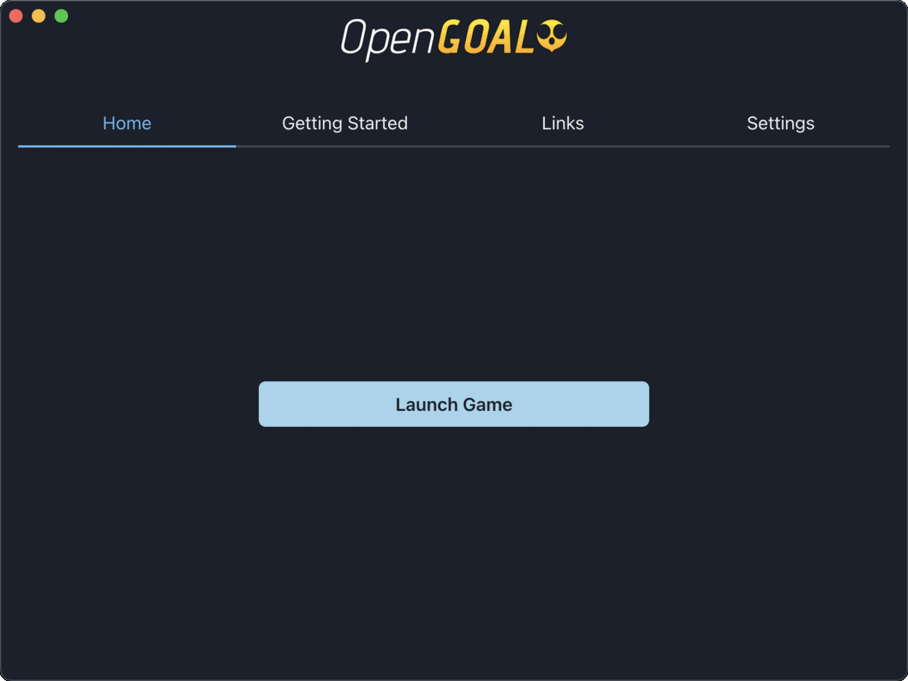

# OpenGOAL Launcher

## Description
A launcher for users to install and run the OpenGOAL project with ease.

## Preview

## Contributing
As of right now, this project is dependent on the user building the OpenGOAL tools themselves, follow the [OpenGOAL README](https://github.com/water111/jak-project#readme) before attempting to run this.
If you are interested in contributing to this project please clone the repo to your local machine and install all dependencies with `npm i`.
To run the application navigate to the root directory and run: `npm run dev`.

## Disclaimer
Users are required to provide their own copy of the ISO file in order to run the game.

## Built With
- [Secure Electron Template](https://github.com/reZach/secure-electron-template)
- [Node.js](https://nodejs.org/en/)
- [Electron](https://www.electronjs.org/)
- [React](https://reactjs.org/)
- [Redux](https://redux.js.org/)
- [Chakra UI](https://chakra-ui.com/)

## Resources
- [OpenGOAL Github Organization](https://github.com/open-goal/)
- [OpenGOAL Documentation](https://open-goal.github.io/)
- [OpenGOAL Discord](https://discord.gg/twBEFbMnqw)