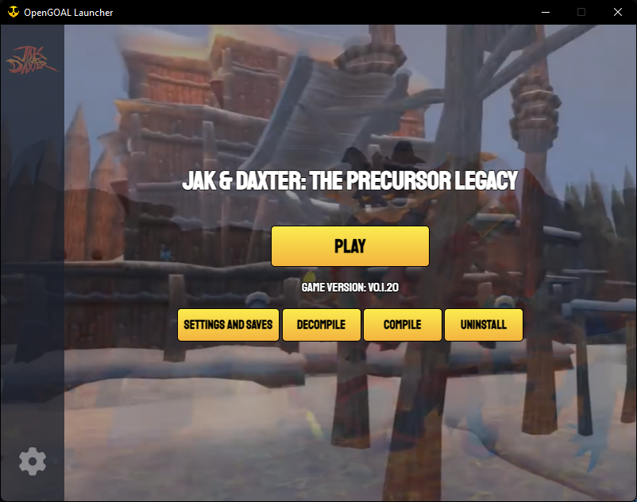
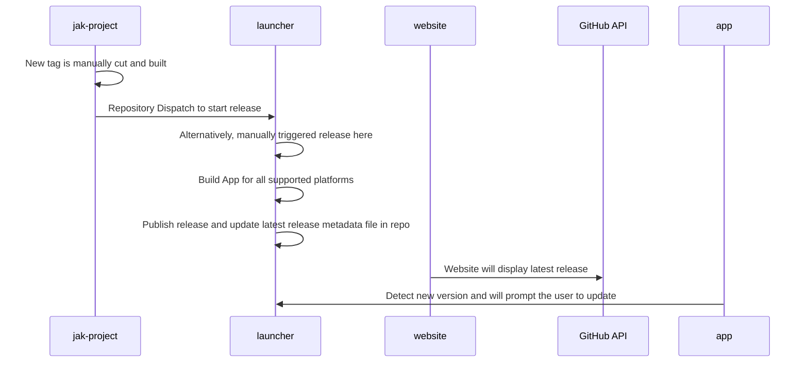

# OpenGOAL Launcher

## Description

A launcher for users to install and run the OpenGOAL project with ease.

## Preview

## Disclaimer

Users are required to provide their own copy of the ISO file in order to run the game.

## Features

- [x] Auto Updates
- [x] Windows Support
- [ ] Linux Support
- [ ] Texture Pack Management
- [ ] Custom Level Management

## Resources

- [OpenGOAL Github Organization](https://github.com/open-goal/)
- [OpenGOAL Documentation](https://opengoal.dev/)
- [OpenGOAL Discord](https://discord.gg/twBEFbMnqw)

## Development

We are using Tauri to build a native cross-platform app with simple Web technology. You will need to setup the prerequesites using the instructions here https://tauri.studio/docs/getting-started/prerequisites

> Additionally, this presumes your environment has WebView2 (windows) or webkit2 (linux) already available. This is a requirement for end-users as well! Many modern OSes already ship with such a thing, but it's something we'll need to investigate.

- `npm install`
- `npm run tauri dev`

This builds the app with Tauri (this is a rust compilation, the first run will take a while) and the frontend is served via Vite -- a nice web server that will hot-reload any changes as you develop.

## Release Process

