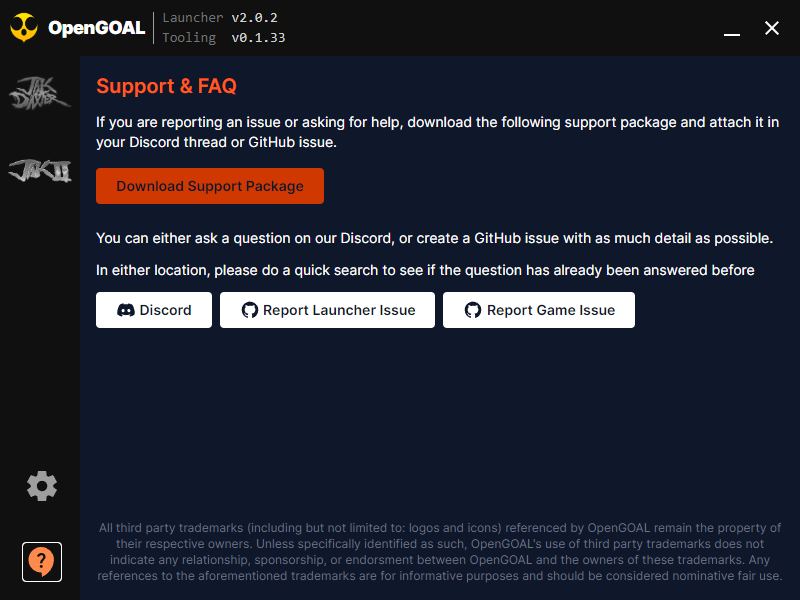

# OpenGOAL Launcher

[](https://crowdin.com/project/opengoal-launcher)

Our attempt at distributing the [OpenGOAL](https://github.com/open-goal/jak-project) releases in a cross-platform and easy to use and update way. It also is a place for features involving the games, such as texture pack or mod management.

The launcher uses the [Tauri](https://tauri.app/) framework, if you are interested in our motivation for _why_ see below.

- [Usage](#usage)
- [Asking for help](#asking-for-help)
- [Development](#development)
  - [Windows](#windows)
  - [Linux (Ubuntu 22.04)](#linux-ubuntu-2204)
  - [Building and Running](#building-and-running)

## Usage

See the [documentation on our website](https://opengoal.dev/docs/usage/installation/) for hopefully up to date instructions on how to use it.

## Asking for help

When asking for help, please download the support package which includes logs to help someone diagnose the problem.



If you cannot do this (for example, the bug relates to making the package / the application won't launch) then you can find the application logs in the following folders:

- Windows `C://Users/<YOUR_USER_NAME>/AppData/Roaming/OpenGOAL-Launcher/logs`
- Linux `/home/<YOUR_USER_NAME>/.config/OpenGOAL-Launcher/logs`

Note that both `AppData` and `.config` are hidden folders.

## Development

Tauri requires a valid Rust installation, as well as a valid NodeJS installation.

For installing Rust, it's recommended to follow the instructions here https://www.rust-lang.org/tools/install

### Windows

```bash
scoop install nodejs
npm install -g yarn
```

### Linux (Ubuntu 22.04)

```bash
sudo apt install libwebkit2gtk-4.0-dev build-essential curl wget libssl-dev libgtk-3-dev libayatana-appindicator3-dev librsvg2-dev # tauri deps, see - https://tauri.app/v1/guides/getting-started/prerequisites#setting-up-linux
curl -o- https://raw.githubusercontent.com/nvm-sh/nvm/v0.39.1/install.sh | bash # installs Node Version Manager (ubuntus package is woefully out of date)
source ~/.bashrc
nvm install lts/hydrogen # installs latest nodejs 18.X
npm install -g yarn
```

### Building and Running

To build and run the application locally, all you have to do is run:

```bash
yarn install
yarn tauri dev
```

<!-- https://www.pwabuilder.com/imageGenerator for generating icons (removed tauricon )-->

TODO:

- clicking on an incompatible version is no longer ignored / is set?
- tabs dont effect the router, fix
- try getting rid of the click border around the icon again
